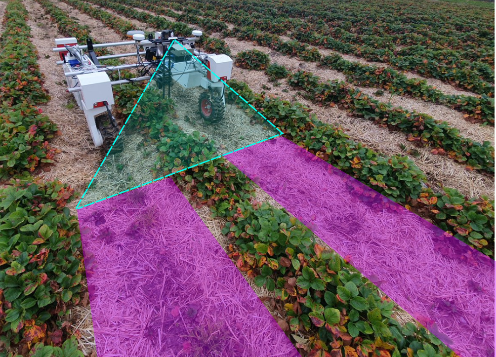
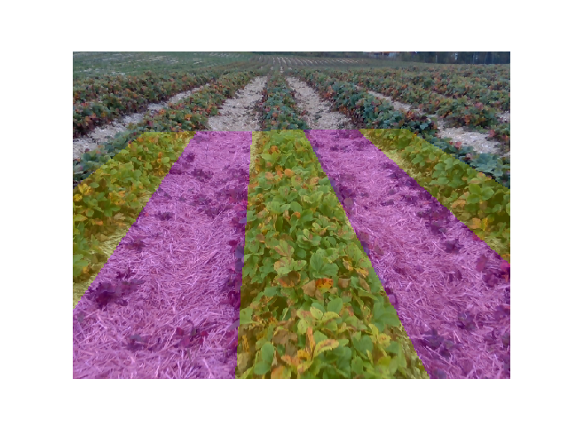

# Autolabel
A tool for generating approximate labels for crop row segmentation by projecting a mask from ground to image.



## Dependencies
  * python=3
  * numpy
  * scipy
  * matplotlib
  * pillow
  * tqdm
  * xmltodict
  * opencv
  
  (to use provided environment)
  * conda
  ([More information about how to use conda environments](https://conda.io/projects/conda/en/latest/user-guide/tasks/manage-environments.html))
  
## Getting started
### Installation
Clone repository and go to root directory

Install dependencies in a conda environment with provided yml file (preferred):
```
conda env create -f environments/conda_env.yml
conda activate autolabel
```


Or use your preferred method for installing python packages.

### Run demo scripts

Run demo.py
```
python demo.py
```
The demo code will produce a projected mask for an example image:


Run the interactive demo to play around with camera extrinsics and robot pose.
```
    python demo_interactive.py
```

## Usage
To use this in your own application, replace the hard-coded values in demo.py with your own data.
You need:
* Intrinsic camera parameters for a rectilinear or fisheye model, see data/camera_model.xml for an example
* Extrinsic camera calibration (angle and position of camera compared to the robot frame)
* Images captured while driving along a crop row
* For each image, robot position and angle compared to the crop row centre line. Alternatively, assume a straight drive and set this to zero

## The paper
This code was used to generate labels to train a convolutional neural network for crop row segmentation in our paper presented at ICRA 2021. The code for data recording and training the neural network is not included in this repository. Please see the full paper for more information about this method and its usage.

If you find this useful, please cite:

```
@inproceedings{Bakken2021RobotSupervised,
    title = {{Robot-supervised Learning of Crop Row Segmentation}},
    year = {2021},
    journal = {Proceedings - IEEE International Conference on Robotics and Automation},
    author = {Bakken, Marianne and Ponnambalam,Vignesh Raja and Moore,Richard J. D. and Gjevestad, Jon Glenn Omholt and From, Pål Johan}
}
```
